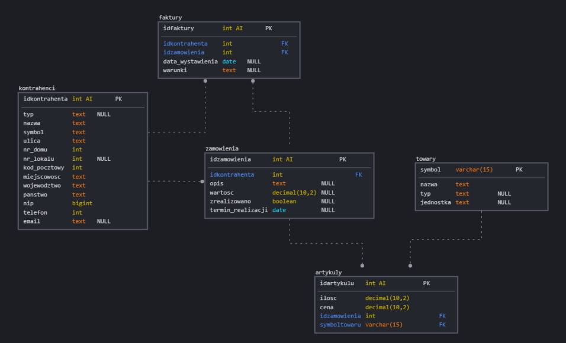
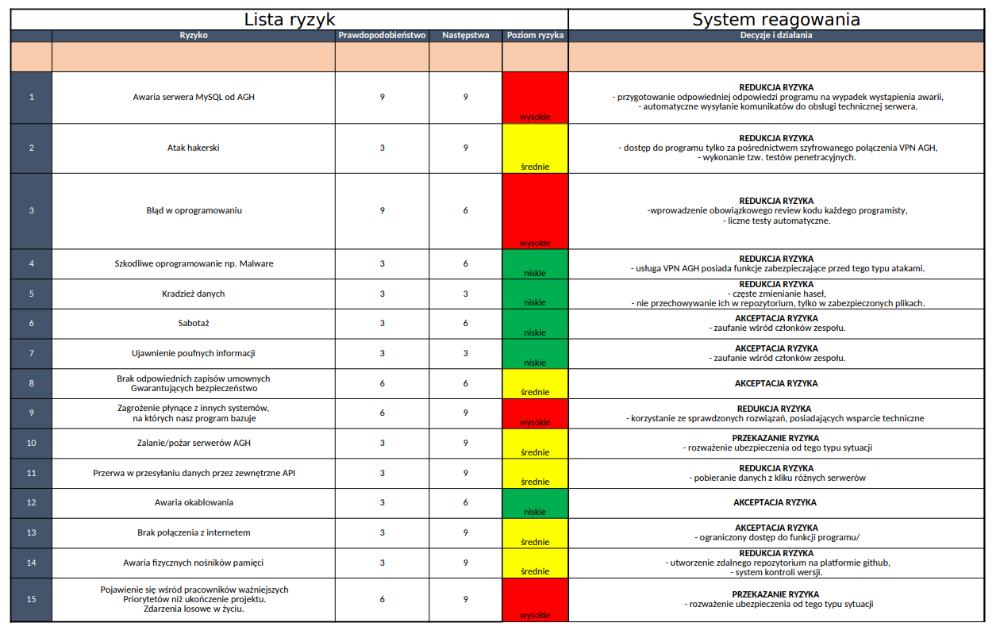
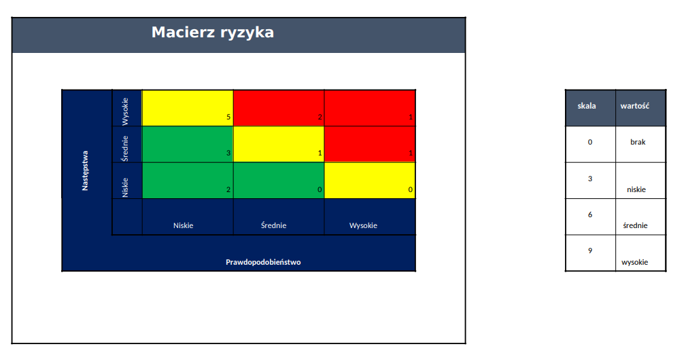

# Docs
Repozytorium zawierające dokumentacje dotyczącą projektu PSS na przedmiocie Inżynieria Oprogramowania (AGH)
## Aby otworzyć podsumowanie dokumentacji danej sekcji projektu należy wybrać jeden w poniższych linków:

### JavaDoc
1. [api](https://profi-sales-system.github.io/Docs/api/index.html)
2. [database](https://profi-sales-system.github.io/Docs/database/index.html)
3. [gui](https://profi-sales-system.github.io/Docs/gui/index.html)

### Opis projektu
1. [Lista wymagań](#lista-wymagań)
2. [Use-cases](#use-cases)
3. [ERD](https://profi-sales-system.github.io/Docs/ERD.png)
4. [DO UZUPEŁNIENIA Architektura systemu](#architektura-systemu)
5. [Opis interfejsów](#opis-interfejsów)
6. [Lista wykorzystywanych technologii](#lista-wykorzystywanych-technologii)
7. [Projekt testów](#projekt-testów)
8. [Analiza Ryzyka](#analiza-ryzyka)
9. [Lista wykorzystywanych narzędzi](#lista-wykorzystywanych-narzędzi)

## Lista wymagań
### Wymagania funkcjonalne:
* sprawne zarządanie księgowością w firmie
* wystawianie faktur
* drukowanie faktur
* dodawanie, usuwanie, edytowanie danych kontrahentów
* dodawanie, usuwanie, edytowanie danych dostawców
* uzupełnianie danych przedsiębiorców na podstawie NIP
* planowanie dostaw
* obsługa zamówień
* obsługa kalendarza
* możliwość przewalutowania cen towarów

### Wymagania niefunkcjonalne:
* niezawodność
* szybkość obliczeń
* bezpieczeństwo
* identyfikacja użytkowników
* autoryzacja
* integralność danych
* odporność na ataki

## Use-cases

### Logowanie do systemu
1.	Przy każdym uruchomieniu aplikacji użytkownik proszony jest o podanie danych logowania.
2.	Użytkownik podaje swój login i hasło nadane wcześniej przez administratora.
3.	System weryfikuje poprawność danych.
4.	Jeśli dane były prawidłowe użytkownik  zostaje zalogowany do systemu, w przeciwnym razie otrzymuje komunikat o błędzie. Trzykrotne niepowodzenie kończy się zablokowaniem konta, które może ponownie odblokować tylko administrator.

### Drukowanie faktury
1.	Użytkownik z menu kontekstowego wybiera zakładkę Faktury od Klientów lub Faktury od Dostawców.
2.	W głównej części wyświetla się tabela z wszystkimi fakturami.
3.	Użytkownik wybiera opcję „Szukaj” w celu odnalezienia interesującej go faktury.
4.	Otwiera się formularz wyszukiwania.
5.	Użytkownik wypełnia pola po których chce wyszukiwać, a następnie zatwierdza.
6.	Jeśli faktura spełniająca podane kryteria znajduje się w bazie danych, to wiersz zawierający ją zostaje wyróżniony innym kolorem. W przeciwnym wypadku użytkownik otrzymuje komunikat, o niepowodzeniu wyszukiwania.
7.	Gdy dany wiersz jest wyróżniony użytkownik możem wybrać opcję „Drukuj”.
8.	System generuje fakturę.
9.	Wyświetla się systemowe okno drukowania.
10.	Użytkownik zatwierdza proces drukowania.
11.	Następuje wydruk faktury.

UWAGA! Użytkownik nie musi skorzystać z opcji „Szukaj”, może także po prostu manualnie poprzez kliknięcie zaznaczyć interesującą go fakturę. Może też zaznaczyć więcej faktur. Wówczas każda z nich zostanie wydrukowana.

### Dodawanie nowego kontrahenta
1.	Użytkownik wybiera kolejno zakładki Kartoteki -> Kontrahenci.
2.	Wyświetla się tabela z wszystkimi kontrahentami.
3.	Użytkownik klika przycisk „+” (Dodaj)
4.	Otwiera się formularz dodawania kontrahenta.
5.	Użytkownik wpisuje numer NIP i zatwierdza klawiszem ENTER.
6.	System sprawdza poprawność NIP pod względem formatu, ale też istnienia w bazie danych.
7.	Jeśli NIP jest poprawny dane z nim powiązane uzupełniają się automatycznie.
Pozostałe pola należy wypełnić ręcznie.
8.	Użytkownik wprowadza wszystkie wymagane dane i zatwierdza przyciskiem „Dodaj”
9.	Dane zapisywane są w bazie danych.
10.	Tabela z kontrahentami odświeża się i pojawia się w niej nowy rekord.

### Dodawanie nowego zamówienia 

1.	Użytkownik wybiera kolejno zakładki Sprzedaż -> Zamówienia
2.	Wyświetla się tabela z wszystkimi zamówieniami.
3.	Użytkownik klika przycisk „+” (Dodaj)
4.	Otwiera się formularz dodawania nowego zamówienia.
5.	Na początku użytkownik powinien wybrać opcję „Dodaj klienta”
6.	Otwiera się formularz dodawania klienta.
7.	Użytkownik uzupełnia wszystkie dane o kliencie i adresie dostawy, następnie zatwierdza.
8.	System sprawdza, czy klient o podanych danych już istnieje w systemie. 
Jeśli tak, wyświetla się okno z listą klientów o tym samym imieniu i nazwisku, klient wybiera manualnie konkretnego klienta i zatwierdza.
Jeśli nie, system pyta, czy dodać nowego klienta i po uzyskaniu pozytywnej odpowiedzi nowy klient zostaje automatycznie zapisany.
9.	Dane klienta pojawiają się u góry formularza dodawania zamówienia.
10.	W tabeli pod sekcją z danymi klienta, użytkownik wybiera opcję „+” (Dodaj),
11.	Wyświetla się okno dodawania towaru do zamówienia.
12.	Użytkownik wybiera dostępny towar z listy towarów i wprowadza jego ilość.
Jeśli użytkownik jest administratorem, w uzasadnionej sytuacji może też zmienić cenę.
Dla zwykłych użytkowników ta opcja jest wyłączona, a cena pobierana jest automatycznie.
13.	Użytkownik zatwierdza wprowadzone dane, klikając przycisk „Dodaj”
14.	W tabeli z zamówionymi towarami pojawia się nowy rekord z danym towarem.
15.	Użytkownik może zakończyć dodawanie zamówienia, bądź też wrócić się do punktu 3) i powtórzyć kolejne czynności w celu dodania większej ilości towarów.
16.	Użytkownik wybiera opcję „Złóż zamówienie”
17.	System przesyła informacje o zamówieniu do odpowiedniej bazy danych i nadaje zamówieniu status „W realizacji”
18.	Tabela z zamówieniami odświeża się i pojawia się w niej nowy rekord.

### Składanie zamówienia od dostawców

1.	Użytkownik wybiera kolejno zakładki Dostawy -> Zamówienia od dostawców
2.	Wyświetla się tabela z wszystkimi zamówieniami.
3.	Użytkownik klika przycisk „+” (Dodaj)
4.	Otwiera się formularz dodawania nowego zamówienia.
5.	System automatycznie generuje zamówienia od dostawców na podstawie niezrealizowanych jeszcze zamówień od klientów.
6.	Użytkownik ma także prawo dodać nowe zamówienie lub edytować zamówienie wygenerowane przez system.
7.	Użytkownik zatwierdza złożenie zamówień od dostawców.
8.	Dane zapisywane są w odpowiedniej bazie danych.
9.	System przesyła mailowo informację o zamówieniu do dostawcy.
10.	Tabela z zamówieniami od dostawców odświeża się i pojawia się w niej nowy rekord.

## Architektura systemu

DO UZUPEŁNIENIA!

## Opis interfejsów

## 1.API:

### Pobieranie kursów walut:
#### pakiet -> pl.io.pss.api.exchange
Tworzymy objekt dla połączenia
``` 
RatesConnector ratesConnector = new RatesConnector();
```

pobranie kursu
```
ratesConnector.ratesRequest(kod, RateType).getRates()[0].getMid());
```
gdzie:
- ``` kod ``` -> String np."EUR"
- ``` RateType ``` -> typ wyliczeniowy, jaki typ kursu oczekujemy, np {MID,ASK,BID}.

### Pobieranie danych firm z GUS:
#### pakiet -> pl.io.pss.api.WsClient
Tworzymy objekt
```
CompanyApi companyApi = new CompanyApi(nip)
```
gdzie ``` nip ``` to String zawirający 10cyfr reprezentujacych firme której dane chcemy pobrać.
samo pobieranie danych:
```
companyApi.data().getFullName();
companyApi.data().getCountry();
companyApi.data().getStreet();
companyApi.data().getCity;
companyApi.data().getPostCode();
companyApi.data().getCity();
companyApi.data().getPhoneNumber();
companyApi.data().getEmail();
```

### Generowanie faktury wraz z formatem PDF:
#### pakiet -> pl.io.pss.api.invoice
Tworzymy obiekt
```
DataForInvoice dataForInvoice = new DataForInvoice();
```    
Ustalamy jaki kontrahent jest nabywcą
```
dataForInvoice.putContractor(idkontrahenta);    
```
Ustwiamy sprzedawce
```
dataForInvoice.putSeller();     
```
I generujemy fakture
```
Invoice.generateInvoice(dataForInvoice.data,idzamowienia);
```
gdzie ``` idzamowienia ``` to numer zamówienia jakiego faktura dotyczy

## 2. Obsługa bazy danych
### Pobieranie informacji

Klasa `DataGetter` pozwala na dostęp do zasobów bazy danych

#### pakiet -> pl.io.pss.api.database

Konstruktor bezargumentowy `public DataGetter()`

Funkcje:

`public Commodity getCommodity(String symbol)`
Pobiera informacje o towarze

`public Order getOrder(int orderID)`
Pobiera informacje o zamówieniu

`public Contractor getContractor(int contractorID)`
Pobiera informacje o kontrahencie

`public Invoice getInvoice(int invoiceID)`
Pobiera informacje potrzebne do wygenerowania faktury

`public ArrayList<Item> getItemsFromOrder(int orderID)`
Zwraca listę przedmiotów z danego zamówienia wraz z cenami i ilością

### Dodawanie i aktualizowanie informacji

Klasa `DataInserter` pozwala pozwala umieszczać/aktualizować informacje w bazie danych  

#### pakiet -> pl.io.pss.api.database

Konstruktor bezargumentowy `public DataGetter()`

Funkcje:

`public boolean insertCommodity(Commodity commodity)` Zapisuje dane towaru do bazy danych

`public boolean insertOrder(Order order)` Zapisuje dane zamówienia do bazy danych

`public boolean insertContractor(Contractor contractor)` Zapisuje dane kontrahenta do bazy danych

`public boolean insertInvoice(Invoice invoice)` Zapisuje dane faktury do bazy danych


### Użyte struktury reprezentacji danych

#### pakiet -> pl.io.pss.api.database.structures

`Commodity` reprezentuje towar (symbol, nazwa, typ, jednostka)   
Konstruktor:   
`public Commodity(String symbol, String  name, String  type, String unit)`  
Funkcje:  
`public String getSymbol()`  
`public String getName()`  
`public String getType()`  
`public String getUnit()`  
`public String toString()`  

`Item` reprezentuje towar wraz z ceną i ilością  
Konstruktor:   
`public Item(Commodity commodity, BigDecimal  count, BigDecimal totalPrice, BigDecimal price)`  
Funkcje:  
`public BigDecimal getCount()`  
`public BigDecimal getTotalPrice()`  
`public BigDecimal getPrice()`  
`public Commodity getCommodity()`  
`public String toString()`  

`Order` reprezentuje zamowienie, czyli listę `Item` oraz dane kontraktora, datę realizacji,
status(zrealizowano lub nie) oraz opis
Konstruktor:   
`public Order(Item[] items, String contractorID, String description, String realizationDate, String realized)`  
Funkcje:  
`public Item[] getItems()`  
`public String getContractorID()`  
`public String getDescription()`  
`public String getRealizationDate()`  
`public String getRealized()`  
`public String toString()`    

`Contractor` reprezentuje wszystkie dane kontrahenta  
Konstruktor:   
`public Order(Item[] items, String contractorID, String description, String realizationDate, String realized)`  
Funkcje:  
`public String getId()`  
`public String getType()`  
`public String getFullName()`  
`public String getSymbol()`  
`public String getStreet()`  
`public String getLocalNumber()`  
`public String getBuildingNumber()`  
`public String getPostCode()`  
`public String getCity()`  
`public String getProvince()`  
`public String getCountry()`  
`public String getNIP()`  
`public String getEmail()`  
`public String getPhoneNumber()`  
`public String toString()`  

`Invoice` reprezentuje dane potrzebne to generowania faktury    
Konstruktor:   
`public Order(Item[] items, String contractorID, String description, String realizationDate, String realized)`  
Funkcje:  
`public Contractor getSeller()`  
`public Contractor getBuyer()`  
`public Order getOrder()`  
`public String getSpecialist()`  
`public String getOrderNr()`  
`public String getDate()`  
`public String getConditions()`  
`public String getInvoiceNr()`  
`public String getDescription()`  
`public BigDecimal getPriceNoTax()`  
`public BigDecimal getTaxValue()`  
`public BigDecimal getTax()`  
`public BigDecimal getOther()`  
`public BigDecimal getPriceTotal()`  
`public String toString()`  

### Wykres ERD



## 3. Interfejs Graficzny Użytkownika
### Widok aplikacji i wyświetlanie
Za całokształt interaktywnego okna aplikacji odpowiedzialna jest klasa `MainController` 
zawierająca następujące metody:

`public void selectLanguage(MouseEvent mouseEvent)` pozwalającą na zmianę języka aplikacji

`public void switchToNewWindow(MouseEvent mouseEvent)` pozwalającą zmienić okno aplikacji

`public void switchToMainWindow(MouseEvent mouseEvent)` umożliwiającą powrót do okna głównego


oraz metody wywoływane przy obsłudze rozwijanego menu kontekstowego, przeciążone przez `MenuController`


`public void showSalesCategoryButtons()` wyświetla dostępne sekcje w module Sprzedaż

`public void showPurchaseCategoryButtons()` wyświetla dostępne sekcje w module Zakup

`public void showWarehouseCategoryButtons()` wyświetla dostępne sekcje w module Magazyn

`public void showFinanceCategoryButtons()` wyświetla dostępne sekcje w module Finanse

`public void showOrganizationCategoryButtons()` wyświetla dostępne sekcje w module Organizacja

`public void showCatalogCategoryButtons()` wyświetla dostępne sekcje w module Kartoteki

`public void showAdministrationCategoryButtons()` wyświetla dostępne sekcje w module Administracja


### Reagowanie na akcje użytkownika
Użytkownik ma możliwość wyboru sekcji, którą chce wyświetlić, bądź edytować. Wybór każdej z nich wiąże się ze zmianą sposobu reakcji na poszczególne akcje.
Np. Przycisk "Dodaj" inaczej będzie działał dla sekcji Kontrahenci, a inaczej dla sekcji Faktury itd. 
Użytkownik może równocześnie mieć otworzonych kilka zakładek, a w każdej z nich inna sekcja, dlatego też aktualnie wybrane sekcje (dalej zwane "aktualnymi stanami") przechowywane są w liście stanów:

`public static ArrayList<MainController> actualStates` w klasie `MainController`

Obecnie wybrana zakładka zapamiętywana jest w `public static MainController currentState`


Każdy stan obsługiwany jest przez inną klasę, będącą kontrolerem.

`ContractorsController` dla Kontrahentów w module Kartoteki

`WaresController` dla Towarów w module Kartoteki

`OrdersFromSuppliersController` dla Zamówień od Dostawców w module Zakup

`PurchaseAjustmentController` dla Korekt w module Zakup

`PurchaseInvoicesController` dla Faktur w module Zakup

`CustomerOrdersController` dla Zamówień w module Sprzedaż

`SalesAjustmentController` dla Korekt w module Sprzedaż

`SalesInvoicesController` dla Faktur w module Sprzedaż

`InventoryController` dla Inwentaryzacji w module Magazyn

`StockLevelsController` dla Stanów Magazynowych w module Magazyn


Każdy kontroler jest klasą dziedziczącą po głównym kontrolerze `MainController` i zawiera następujące przeciążone metody, które definiują sposób reagowania na wybór konkretnego przycisku:

Obsługa przycisku „Dodaj”
`public void pressedAddButton(MouseEvent mouseEvent)`

Obsługa przycisku „Usuń”
`public void pressedRemoveButton(MouseEvent mouseEvent)`

Obsługa przycisku „Filtruj”
`public void pressedFilterButton(MouseEvent mouseEvent)`

Obsługa przycisku „Szukaj”
`public void pressedFindButton(MouseEvent mouseEvent)`

Obsługa przycisku „Drukuj”
`public void pressedPrintButton(MouseEvent mouseEvent)`

Obsługa przycisku „Zobacz”
`public void pressedViewButton(MouseEvent mouseEvent)`

Obsługa przycisku „Edytuj”
`public void pressedEditButton(MouseEvent mouseEvent)`


Ponadto klasy kontrolujące mają zdefiniowane medoty:

`public ContractorsController addNewBookmark(String title)` tworzy nową zakładkę o tytule: `String title`

`public ContractorsController setTheTable()` komunikuje się z bazą danych i generuje tabelę do wyświetlenia 


## Lista wykorzystywanych technologii

- backend:\
Java 17 \
Korzystanie z nowoczesnego języka obiektowego.
Przenośność kodu pomiędzy różnymi systemami operacyjnymi.
Dzięki temu nasza aplikacja będzie kompatybilna z większością systemów operacyjnych.

- frontend:\
Java FX\
Prawidłowe wyświetlanie na większości systemów operacyjnych.
Zawiera dużo przydatnych funkcjonalności, które wykorzystujemy do budowy aplikacji.

- bazy danych: \
MySQL\
Jest to wydajny i open-source’owy system zarządzania relacyjnymi bazami danych. 
Rozwijany jest przez firmę Oracle.


## Projekt testów

Testy zostaną napisane z pomocą narzędzia jUnit

GUI
1.	Testowanie działania poszczególnych przycisków.
2.	Testowanie responsywności okien.
3.	Testowanie opcji zmiany języka.
4.	Testowanie, czy  wyświetlane tabele z danymi aktualizują się prawidłowo po dodaniu/edytowaniu/usunięciu jakiś informacji.
5.	Testowanie, czy użytkownik otrzymuje komunikat o błędach, w przypadku wprowadzenia nieprawidłowych danych.

Baza danych
1.	Poprawna reakcja w przypadku braku połączenia z internetem.
2.	Poprawne działanie logowania i autoryzacji.
3.	Działanie w przypadku wysłania wybrakowanych danych.
4.	Odpowiednia reakcja zwrotna przy próbie dodania już istniejących danych.
5.	Poprawna archiwizacja danych.


## Analiza Ryzyka
### Lista ryzyk


### Macierz ryzyka


## Lista wykorzystywanych narzędzi

1. Repozytorium na platformie github.com
- Zabezpieczenie przez utratą kodu, możliwość lepszej współpracy.

2. środowisko Idea IntelliJ
- Niezawodność 
- Kolorowanie kodu 
- Dobry debugger

3. Scene Builder
- Obsługa języka szablonowego FXML
- Łatwość budowania okien.

4. Discord
- Komunikacja w zespole.

5. Trello
- Planowanie pracy

